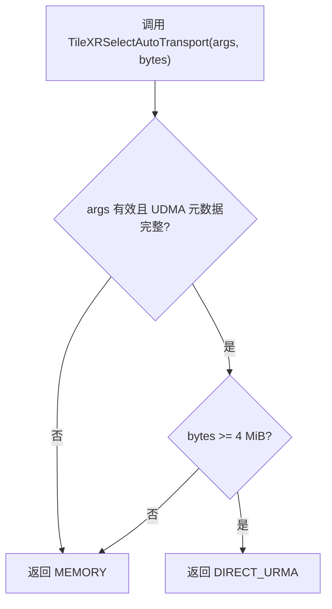
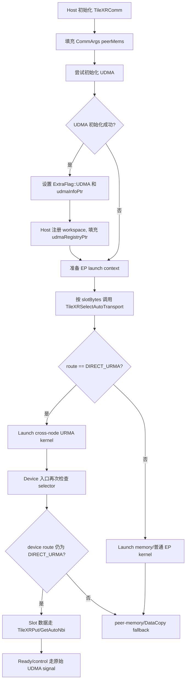

# TileXR 传输 Auto Route 设计与实现说明

日期：2026-07-20

状态：已按当前代码实践落地，本文档记录最终策略、接口、EP 接入方式、验证结果和后续边界。

## 摘要

TileXR 增加了一层统一传输选择能力，用于在 kernel 数据搬运时根据数据量和 direct URMA 能力自动选择：

```text
URMA 可用 && bytes >= 4 MiB -> direct_urma
否则                         -> memory
```

当前实现将策略集中在公共 header：

```text
src/include/tilexr_transport.h
```

对外暴露：

```cpp
TileXR::TileXRDirectUrmaAvailable(args)
TileXR::TileXRSelectAutoTransport(args, bytes)
TileXR::TileXRPutAutoNbi<T>(args, peer, localSrc, remoteOffset, bytes)
TileXR::TileXRGetAutoNbi<T>(args, peer, localDst, remoteOffset, bytes)
```

EP 已接入该策略：

- Host launch 层使用 selector 决定是否进入 cross-node direct URMA kernel。
- Device kernel 层也有 selector guard，避免未来绕过 host gate 时小数据误入 URMA-only 路径。
- EP 的大块 slot 数据搬运使用 `TileXRPutAutoNbi` / `TileXRGetAutoNbi`。
- 8 字节 ready/control 消息继续使用原始 UDMA ready/signal 路径，不进入 auto wrapper。

## 名词约定

本文档中的 `direct_urma` 对应当前 TileXR 代码中的 UDMA registered-memory 数据通路。命名上保留用户侧 benchmark 中的 `direct_urma`，实现上仍使用已有 UDMA 元数据和 device API：

```text
ExtraFlag::UDMA
CommArgs::udmaInfoPtr
CommArgs::udmaRegistryPtr
UDMAPutNbi / UDMAGetNbi / UDMAPutSignalNbi / UDMAQuiet
```

`memory` 指 TileXR peer-memory IPC 路径：

```text
args->peerMems[rank] + TileXR::IPC_DATA_OFFSET
AscendC::DataCopy / DataCopyPad
```

## 测试数据依据

auto 策略基于以下两份测试数据：

```text
D:\TileXR\full_memory_unidir_bd1.csv
D:\TileXR\full_direct_urma_unidir_bd1.csv
```

测试形态：

```text
traffic:   unidir
block_dim: 1
direction: 0to1
ranks:     2
sizes:     8 B 到 64 MiB
iters:     20
status:    所有行均为 0
errors:    所有行均为 0
```

按 bytes 对齐后的关键结论：

```text
bytes      memory avg_us   direct_urma avg_us   更优路径
8          4.415           7.018                memory
1 KiB      4.884           6.419                memory
64 KiB     4.678           8.506                memory
1 MiB      23.724          27.104               memory
2 MiB      44.778          46.971               memory
4 MiB      85.824          85.757               direct_urma
8 MiB      168.904         165.536              direct_urma
16 MiB     335.976         323.398              direct_urma
32 MiB     754.420         639.425              direct_urma
64 MiB     1692.640        1271.109             direct_urma
```

因此第一版阈值精确定为：

```text
bytes < 4 MiB  -> memory
bytes >= 4 MiB -> direct_urma, 但必须先满足 URMA 可用
```

4 MiB 点两者性能非常接近，但它是测试数据中 direct URMA 第一次胜出的点。8 MiB 是优势更明显的点，不作为第一版阈值。

## 目标

- 提供一个统一的 TileXR auto transport selector。
- 提供公开的 auto Put/Get wrapper 名称，便于 EP 和后续模块复用。
- 第一版策略固定、可测试、可复现：`URMA 可用 && bytes >= 4 MiB -> direct_urma`。
- direct URMA 不可用时保守回退 memory。
- 不改变 UDMA 初始化和注册内存语义。
- 不改变 memory 与 UDMA 的地址模型，只在统一接口层隐藏选择逻辑。
- 保持 host-only 单元测试可以 include 新 header，不依赖 AscendC 编译器。

## 非目标

- 不做运行时动态 benchmark。
- 不做芯片、rankSize、direction、blockDim 维度的阈值表。
- 不把 SDMA 纳入 auto route。
- 不把任意 remote pointer 自动映射成 UDMA remote address。
- 不把 ready/control 小消息自动路由到 memory fallback。
- 不承诺当前单进程 UDMA 测试覆盖真实多机 direct URMA 数据面性能。

## 当前实现结构

```text
src/include/tilexr_transport.h
    统一 route enum、可用性判断、selector、auto Put/Get wrapper

src/comm/CMakeLists.txt
    安装 tilexr_transport.h 到 install/include

src/ep/host/ep_kernel_launch.cpp
    Host 侧根据 auto selector gate cross-node dispatch/combine kernel

src/ep/kernels/tilexr_ep_dispatch_kernel.cpp
    Dispatch kernel 的 UDMA window 使用 selector
    Slot Put/Get 数据搬运使用 auto wrapper
    Cross-node kernel 入口增加 selector guard

src/ep/kernels/tilexr_ep_kernel_common.h
    Combine 公共 helper 引入 selector guard
    Combine slot 数据搬运使用 auto wrapper

src/ep/kernels/tilexr_ep_combine_kernel.cpp
    Cross-node combine kernel 入口使用公共 direct URMA guard

tests/udma/unit/test_tilexr_transport_auto_route.cpp
    host-only selector 和 wrapper 可见性测试

tests/udma/unit/test_tilexr_udma_source_guard.cpp
    UDMA/EP 源码边界检查，防止迁移点退回散落判断

tests/ep/unit/test_tilexr_ep_kernel_sources.cpp
    EP source guard，检查 host/device selector gate 和 auto wrapper 使用

tests/udma/build.sh / tests/udma/run_tests.sh / tests/udma/CMakeLists.txt
    UDMA 测试链路接入 auto route 测试

scripts/common_env.sh
    补充 bisheng 编译器 PATH 发现，保证 EP full build 可复现
```

## 公共接口设计

### Route 类型

```cpp
enum class TileXRTransportKind : uint8_t {
    MEMORY = 0,
    DIRECT_URMA = 1,
};
```

### 阈值常量

```cpp
constexpr uint64_t TILEXR_AUTO_DIRECT_URMA_THRESHOLD_BYTES =
    4ULL * 1024ULL * 1024ULL;
```

单位采用二进制 MiB：

```text
1 MiB = 1024 * 1024 bytes
4 MiB = 4194304 bytes
```

### Direct URMA 可用性

当前实现：

```cpp
TileXRDirectUrmaAvailable(args)
```

语义：

```text
args != nullptr
(args->extraFlag & ExtraFlag::UDMA) != 0
args->udmaInfoPtr != nullptr
args->udmaRegistryPtr != nullptr
```

这里要求 `udmaRegistryPtr` 非空，是因为 direct URMA 数据面只对已注册 workspace 的 offset 合法。只有 `udmaInfoPtr` 或能力位还不足以发起 registered-memory 数据搬运。

### Selector

```cpp
TileXRSelectAutoTransport(args, bytes)
```

流程：



边界行为：

```text
args == nullptr       -> MEMORY
bytes == 0            -> MEMORY
bytes == 4 MiB - 1    -> MEMORY
bytes == 4 MiB        -> DIRECT_URMA if available, otherwise MEMORY
bytes > 4 MiB         -> DIRECT_URMA if available, otherwise MEMORY
```

### Auto Put/Get Wrapper

当前实现提供：

```cpp
template <typename T>
TileXRTransportKind TileXRPutAutoNbi(
    const CommArgs* args,
    int targetRank,
    const T* localSrc,
    uint64_t remoteOffset,
    uint32_t bytes);

template <typename T>
TileXRTransportKind TileXRGetAutoNbi(
    const CommArgs* args,
    int sourceRank,
    T* localDst,
    uint64_t remoteOffset,
    uint32_t bytes);
```

AscendC device 编译时，wrapper 行为是：

```text
route = TileXRSelectAutoTransport(args, bytes)

if route == DIRECT_URMA:
    调用 UDMAPutNbi / UDMAGetNbi

return route
```

普通 host 编译时，wrapper 只返回 selector 结果，不调用 AscendC/UDMA device API。这保证了 host-only 测试可以编译公共 header。

重要约定：

- wrapper 当前只直接执行 `DIRECT_URMA` 分支。
- `MEMORY` 分支由调用方根据返回值执行已有 peer-memory/DataCopy 逻辑。
- wrapper 接收的是 `peerRank + remoteOffset + bytes`，不是任意 remote pointer。
- `remoteOffset` 在 direct URMA 分支解释为 registered region offset。
- memory fallback 调用方如果需要执行，必须能把同一个 offset 映射到 peer-memory window。

## Host 和 Device 双层 Gate

### Host launch gate

EP host launch 层通过 `TileXREpUsesCrossNodeKernel(context)` 判断是否进入 cross-node direct URMA kernel。

当前条件：

```text
hostArgs != nullptr
hostArgs->localRankSize > 0
hostArgs->localRankSize < hostArgs->rankSize
window.slotBytes > 0
TileXRSelectAutoTransport(hostArgs, slotBytes) == DIRECT_URMA
```

这里使用 `slotBytes` 作为 route bytes，是因为 EP 实际跨 rank 搬运的单位是每个 peer slot。slot 中包含 header、payload、assist 区域，而不是单独某个 payload 指针。

### Device kernel guard

为了防止未来有人绕过 host launch gate 直接调用 cross-node kernel，device kernel 入口也保留同样的策略约束：

```text
TileXRSelectAutoTransport(args, slotBytes) == DIRECT_URMA
```

当前覆盖：

- `tilexr_ep_dispatch_cross_node_kernel`
- `tilexr_ep_combine_cross_node_kernel`

combine 公共 helper 中抽出：

```cpp
TileXREpUsesDirectUrmaTransport(args, slotBytes)
```

用于保持入口检查语义一致。

## EP 数据面接入

### Dispatch 普通 kernel

普通 dispatch kernel 根据 selector 决定是否使用 UDMA window：

```text
workspaceGM != nullptr
rank 跨节点
TileXRSelectAutoTransport(args, slotBytes) == DIRECT_URMA
```

如果返回 `DIRECT_URMA`：

- local window 使用 UDMA workspace。
- slot 同步/拉取通过 `TileXRGetAutoNbi` 或 `TileXRPutAutoNbi`。

如果返回 `MEMORY`：

- 保持原 peer-memory window。
- 继续使用 `SyncCollectives` 和 DataCopy 路径。

### Cross-node dispatch kernel

cross-node dispatch kernel 是 direct URMA 专用路径。入口必须满足：

```text
UDMARegistryEnabled(args)
TileXRSelectAutoTransport(args, slotBytes) == DIRECT_URMA
shape 参数合法
workspaceGM 非空
```

数据 slot 搬运使用 auto wrapper：

```text
TileXRPutAutoNbi<uint8_t>
TileXRGetAutoNbi<uint8_t>
```

### Cross-node combine kernel

combine 阶段也只在 direct URMA 可用且 `slotBytes >= 4 MiB` 时进入 cross-node URMA path：

```text
UDMARegistryEnabled(args)
TileXREpUsesDirectUrmaTransport(args, slotBytes)
```

跨节点 slot 数据搬运使用 `TileXRPutAutoNbi<uint8_t>`。

## Ready/Control 消息例外

8 字节 ready/status/control 消息不能直接套 auto wrapper。

原因：

```text
bytes = sizeof(uint64_t) < 4 MiB
auto selector 会返回 MEMORY
```

但这些 ready/control 消息所在路径是 URMA-only 的跨节点同步协议，没有对应的 memory fallback。因此当前实现保留原始 UDMA ready/signal API：

```text
UDMAPutNbi<uint8_t>(..., sizeof(uint64_t))
UDMAPutSignalNbi<uint8_t>(...)
UDMAQuiet(...)
```

这不是 auto route 的遗漏，而是有意保留的控制面语义。auto wrapper 只用于有明确 direct URMA 数据搬运语义的 slot 数据。

## 完整调用流程



## 构建与脚本实践

### UDMA 测试链路

`tests/udma` 已接入 auto route 单测：

```text
test_tilexr_transport_auto_route
test_tilexr_udma_transport_layout
test_tilexr_udma_registry
test_tilexr_udma_source_guard
test_tilexr_udma
```

`run_tests.sh` 中 `LD_LIBRARY_PATH` 同时包含 `lib64` 和 `lib`：

```bash
export LD_LIBRARY_PATH="${INSTALL_DIR}/lib64:${INSTALL_DIR}/lib:${TILEXR_ROOT}/install/lib64:${TILEXR_ROOT}/install/lib:/usr/local/lib:${LD_LIBRARY_PATH}"
```

这样可以优先加载当前仓库刚 install 的 `libtile-comm.so`，避免误用 `/usr/local/lib` 中的旧库。

### EP full build

`tests/ep/build.sh full` 会构建：

```text
libtile-comm.so
libtilexr-ep.so
libtilexr_ep_dispatch_kernel.so
libtilexr_ep_combine_kernel.so
tilexr_ep_dispatch_demo
```

实践中 62/70 的 `bisheng` 实际位于：

```text
/usr/local/Ascend/cann-9.1.0/tools/bisheng_compiler/bin/bisheng
```

因此 `scripts/common_env.sh` 已补充对以下目录的 PATH 发现：

```text
${ASCEND_HOME_PATH}/tools/bisheng_compiler/bin
${ASCEND_HOME_PATH}/${TILEXR_OS_ARCH}-linux/bin
/usr/local/Ascend/cann-${TILEXR_CANN_VER}/tools/bisheng_compiler/bin
```

## 验证结果

### 本地验证

已在本地执行：

```text
git diff --check
test_tilexr_transport_auto_route
test_tilexr_udma_source_guard
test_tilexr_ep_kernel_sources
```

结果均通过。

### 远端同步

按项目要求，本地到远端的文件同步通过 mutagen 完成：

```text
tilexr-auto-route-62-20260720-151042
tilexr-auto-route-70-20260720-151042
```

同步后远端路径：

```text
root@141.62.24.62:/home/l00929943/TileXR_codex_auto_route_20260720_151042
root@141.62.24.70:/home/l00929943/TileXR_codex_auto_route_20260720_151042
```

### 62 和 70 验证

两台机器均执行：

```bash
cd /home/l00929943/TileXR_codex_auto_route_20260720_151042
source scripts/common_env.sh
cd tests/ep
bash build.sh full
ctest --test-dir build --output-on-failure
cd ../udma
BUILD_TILEXR_UDMA_DEMO=OFF bash build.sh
bash run_tests.sh
```

结果：

```text
EP full build: PASS
EP ctest:      4/4 PASS
UDMA Test 1 (Auto Route):    PASS
UDMA Test 2 (UDMA Layout):   PASS
UDMA Test 3 (UDMA Registry): PASS
UDMA Test 4 (Source Guard):  PASS
UDMA Test 5 (TileXR Single): PASS
```

多进程 MPI 测试未实际覆盖两 rank 数据面：

```text
141.62.24.62: Detected 0 NPU(s), skip multi-rank
141.62.24.70: mpirun not found, skip multi-rank
```

脚本按 skip 条件返回成功。后续要证明真实跨节点 direct URMA 性能，需要在具备可用 NPU 和 MPI 环境的 2 rank/2 host 场景下单独执行硬件验证。

## 测试覆盖

当前 host-only auto route 单测覆盖：

```text
args == nullptr                         -> MEMORY
bytes == 0                              -> MEMORY
URMA 可用, bytes < 4 MiB                -> MEMORY
URMA 可用, bytes == 4 MiB               -> DIRECT_URMA
URMA 可用, bytes > 4 MiB                -> DIRECT_URMA
未设置 UDMA flag, 大数据                -> MEMORY
缺少 udmaInfoPtr, 大数据                -> MEMORY
缺少 udmaRegistryPtr, 大数据            -> MEMORY
host 编译下 Put/Get wrapper 返回 route   -> PASS
```

Source guard 覆盖：

```text
EP kernel include tilexr_transport.h
EP 数据 slot 使用 TileXRPutAutoNbi / TileXRGetAutoNbi
Host launch gate 使用 TileXRSelectAutoTransport
Device cross-node kernel guard 使用 TileXRSelectAutoTransport
comm 源码仍不引入 shmem
```

## 风险和规避

风险：4 MiB 阈值只来自当前两份 unidir bd1 数据。

规避：阈值集中在 `TILEXR_AUTO_DIRECT_URMA_THRESHOLD_BYTES`，后续可替换为按芯片/拓扑/方向区分的策略表。

风险：`DIRECT_URMA` 名称与源码历史 UDMA 命名不一致。

规避：文档明确 `DIRECT_URMA` 是策略名，实现仍使用 `ExtraFlag::UDMA`、`udmaInfoPtr`、`udmaRegistryPtr` 和 UDMA device API。

风险：auto wrapper 当前 memory 分支只返回 route，不直接 DataCopy。

规避：这是当前接口边界。调用方必须在返回 `MEMORY` 时保留已有 peer-memory/DataCopy fallback。

风险：ready/control 小消息不走 auto，容易被误认为遗漏。

规避：文档和 source guard 明确 slot data 和 control plane 的分工。ready/control 没有 memory fallback，继续使用原 UDMA signal API。

风险：host gate 和 device guard 重复。

规避：这是防御式设计。host gate 是正常入口选择；device guard 是未来维护时的安全边界。

## 后续工作

建议后续单独推进：

1. 在真实 2 rank/2 host 可用 NPU 环境跑 auto/memory/direct_urma 端到端性能矩阵。
2. 如果更多数据证明 4 MiB 对不同芯片或方向不稳定，再引入 host/config 阈值表。
3. 评估是否将 collectives 中相同形态的 rank+offset 数据搬运迁移到 auto wrapper。
4. 如需 force-direct-URMA 模式，应和 auto 模式分离。force 模式在 URMA 不可用时应报错，不应回退 memory。

## 已确认决策

- Auto 默认阈值：4 MiB。
- 边界：`bytes >= 4 MiB` 且 direct URMA 可用时选择 `DIRECT_URMA`。
- 回退：direct URMA 不可用时选择 `MEMORY`。
- 实际 route bytes：EP 使用 `slotBytes`，不是裸 payload bytes。
- 公开接口：`TileXRSelectAutoTransport`、`TileXRPutAutoNbi`、`TileXRGetAutoNbi`。
- ready/control 小消息不进入 auto wrapper。
- host 和 device 均保留 direct URMA selector gate。
