# TileXR EP Memory / Direct URMA 统一路由设计

## 1. 文档定位

本文是 TileXR EP 通信在 `MEMORY` 与 `DIRECT_URMA` 两条数据面之间进行统一路由的权威设计与
实现说明。内容以 2026-07-28 的 `feature/tilexr-auto-route` 实际代码和 Ascend950PR 硬件验证结果
为准。

本文同时回答以下问题：

- Host API 如何在不改变公开调用入口的情况下选择数据面；
- `auto`、`memory`、`direct_urma` 三种模式的精确语义；
- 同机和跨机分别使用什么阈值；
- selector 中的 `bytes` 在当前 EP 实现里具体表示什么；
- Memory 与 Direct URMA 各自使用什么地址空间、同步方式和完成语义；
- Direct URMA workspace 如何计算、注册和校验；
- 同机 Direct URMA 如何确保设备端真正走 UDMA；
- 哪些能力已经在硬件上验证，哪些仍属于剩余风险。

本文只覆盖 EP dispatch/combine 的统一路由。collectives、独立 UDMA demo、SDMA，以及 EP 之外的
其他模块不自动继承本文策略。

## 2. 目标与非目标

### 2.1 目标

保留同一组 EP Host API，由 Host 在每次 dispatch 或 combine 调用前选择以下一条真实数据面：

```text
MEMORY
    peerMems[] + IPC_DATA_OFFSET + AICore DataCopyPad

DIRECT_URMA
    ordinary device workspace + TileXRUDMARegister + UDMA put/get/signal
```

设计必须满足：

1. Memory 和 Direct URMA 均可强制选择并独立验证。
2. 同机和跨机 Memory 复用同一套 peer-memory/DataCopy 实现。
3. 同机和跨机 Direct URMA 复用同一套 registered-workspace kernel。
4. 一次 Host API 调用只解析一次 route，校验和 kernel launch 使用同一个结果。
5. `auto` 只做策略选择，不执行数据搬运，也不隐式申请或注册 workspace。
6. Direct URMA 不可用时，`auto` 可选择 Memory；强制 Direct URMA 不允许静默回退。
7. TCP socket 只用于 communicator rendezvous、注册信息交换和测试 barrier，不承载 EP payload。

### 2.2 非目标

- 不引入 host-staging 作为第三种生产 transport。
- 不把 Memory 和 UDMA 强行封装成一个缺少地址上下文的 device put/get primitive。
- 不修改 EP 公共 C API 签名。
- 不修改 UDMA registered-memory 的 offset 地址模型。
- 不修改 Ascend950 IPC buffer 的 malloc policy。
- 不使用 host-only、simulator 或 host-staging 结果替代真实 Ascend950 数据面验证。
- 不声称当前 rank-2 验证已经覆盖任意 rank 数、混合节点拓扑和 TP 组合。

## 3. 核心结论

### 3.1 最终 Auto 策略

在 communicator 元数据有效且 Direct URMA capability/registry 可用时：

```text
跨机：routeBytes < 128 KiB  -> MEMORY
跨机：routeBytes >= 128 KiB -> DIRECT_URMA

同机：routeBytes < 4 MiB    -> MEMORY
同机：routeBytes >= 4 MiB   -> DIRECT_URMA
```

若 Direct URMA 不可用，则不论大小均选择 `MEMORY`。边界使用 `>=`，因此 `128 KiB` 和 `4 MiB`
本身属于 Direct URMA。

### 3.2 当前 `routeBytes` 的精确定义

当前 EP Host 实现传给 `TileXRSelectAutoTransport` 的不是输入 tensor 字节数，也不是某一个 peer 的
实际发送字节数，而是：

```cpp
routeBytes = static_cast<uint64_t>(context.window.totalBytes);
```

`window.totalBytes` 是单个 EP window 的总容量，包含 window header 和全部 rank slot 的最坏情况
容量。本文统一称其为 `routeBytes`。

这一定义非常重要：

- `routeBytes` 是 Host 在 launch 前可稳定计算的 operation footprint；
- 它与当前 Memory window 容量校验使用同一口径；
- 它不是运行时实际命中的 route 数，也不是单条 UDMA put 的字节数；
- CSV 中的 `bytes` 是单向单流 benchmark 的实际传输大小，与 `routeBytes` 不是完全相同的统计口径。

因此，当前两个阈值已经完成路由正确性和端到端数据正确性验证，但不能据此声称每个 EP shape 都
实现了严格的性能最优选择。若后续要求更精细的性能路由，应评估改用 `slotBytes`、最大远端 peer
payload 或运行时 route histogram；该变化属于新的策略版本，必须重新采样和验证。

## 4. 术语与拓扑前提

| 术语 | 精确定义 |
|---|---|
| `rankSize` | communicator 的全局 rank 数 |
| `localRankSize` | communicator 认为同一 full-mesh 本地节点内的 rank 数 |
| 同机 | `localRankSize == rankSize` |
| 跨机 | `0 < localRankSize < rankSize` |
| `peerMems[]` | communicator 建立并上传到 `CommArgs` 的 IPC peer window 地址 |
| registered workspace | 应用申请的普通 device memory，经 `TileXRUDMARegister` 注册后形成的 UDMA region |
| `routeBytes` | 当前实现中的 `EpWindowConfig::totalBytes` |
| operation | 一次 dispatch 或一次 combine Host API 调用 |

当前 device helper 使用 `rank / localRankSize` 判断节点归属，因此实现假设：

- `localRankSize` 大于 0；
- 每个节点包含相同数量的 rank；
- 同一节点的 global rank 连续排列。

不满足这些前提的非均匀拓扑不在当前设计验证范围内。

## 5. 总体架构

路由只在 Host 层解析，设备 kernel 不再读取环境变量，也不重新执行 auto selector。

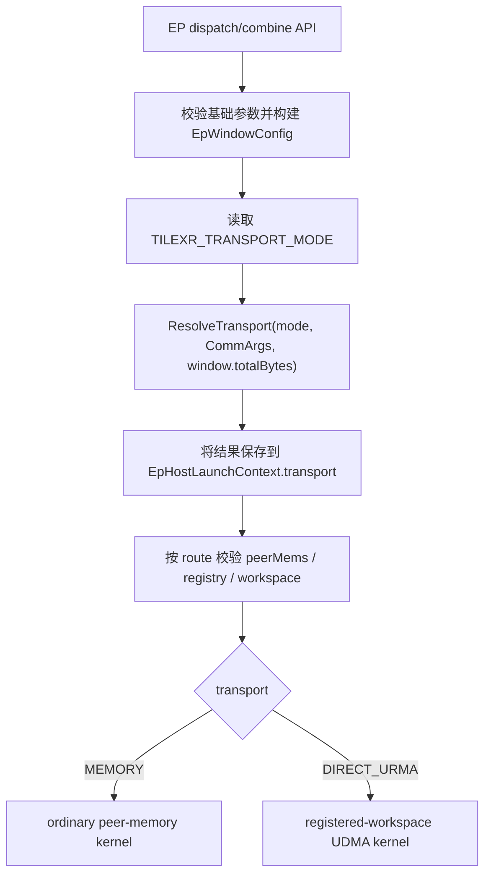

关键边界如下：

- `TileXREpPrepareLaunchContext` 负责 dispatch 的 window、route 和资源校验；
- `TileXREpPrepareCombineLaunchContext` 对 combine 独立执行同样流程；
- `EpHostLaunchContext.transport` 是一次调用内唯一可信 route；
- `ep_kernel_launch.cpp` 只读取 `context.transport`，不得再次读取 env 或 selector；
- dispatch 和 combine 是两个独立 operation，会分别解析 route；调用方不应在并发或配对调用之间
  动态修改进程级 `TILEXR_TRANSPORT_MODE`。

### 5.1 代码模块与职责

| 模块 | 关键文件 | 职责 |
|---|---|---|
| 公共 selector | `src/include/tilexr_transport.h` | 定义 transport kind、capability 判定、同机/跨机阈值和 auto 决策 |
| EP mode adapter | `src/ep/host/ep_transport_route.{h,cpp}` | 解析环境变量，将 `auto/memory/direct_urma` 转换为确定 route |
| EP window/layout | `src/ep/host/ep_layout.cpp`、`src/ep/common/ep_window.h` | 计算 `slotBytes`、`totalBytes`、UDMA operation/workspace 布局 |
| Host launch context | `src/ep/host/ep_launch_context.cpp` | 一次性完成参数、route、peer mapping、registry 和 workspace 校验 |
| Kernel launch | `src/ep/host/ep_kernel_launch.cpp` | 只依据 `context.transport` 选择 Memory 或 Direct kernel |
| Device data plane | `src/ep/kernels/tilexr_ep_*` | 实现 IPC DataCopy、UDMA put/quiet、ready/status 和 drain |
| Communicator | `src/comm/tilexr_comm.cpp` | 发现 `rankSize/localRankSize`、建立 `peerMems[]`、初始化 UDMA context |
| UDMA context | `src/comm/udma/tilexr_udma_context.cpp` | 对外管理 register/unregister、registry 和 `CommArgs` 状态 |
| UDMA transport | `src/comm/udma/tilexr_udma_transport.cpp` | 建 route/context/QP、注册本地 MR、导入远端 MR、生成 device UDMA info |

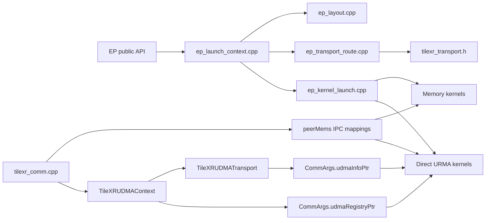

## 6. EP Window 与路由大小计算

### 6.1 基础常量

```text
kEpWindowAlignmentBytes = 32
kEpWindowHeaderBytes    = 64
kEpSrcSlotHeaderBytes   = 64
kEpAssistTupleInts      = 4
sizeof(EpAssistTuple)   = 16 bytes
IPC_BUFF_MAX_SIZE       = 100 MiB
IPC_DATA_OFFSET         = 2 MiB
```

### 6.2 Dispatch window

设：

```text
routesPerToken  = topK + sharedExpertNum
maxRoutesPerSrc = bs * routesPerToken
dtypeBytes      = 1 for INT8, 2 for FP16/BFP16
rowBytes        = h * dtypeBytes
payloadExtra    = 4 bytes when quantMode == per-token dynamic, otherwise 0
```

则：

```text
payloadBytesPerSlot = align32(maxRoutesPerSrc * (rowBytes + payloadExtra))
assistBytesPerSlot  = align32(maxRoutesPerSrc * 16)
slotBytes           = align32(64 + payloadBytesPerSlot + assistBytesPerSlot)
totalBytes          = 64 + rankSize * slotBytes
routeBytes          = totalBytes
```

所有乘加操作在 Host 侧进行有符号 64 位溢出检查。`totalBytes > 100 MiB` 时直接返回参数错误。

TP 模式还要求：

```text
align32(totalBytes) * (effectiveTpWorldSize + 2) <= 100 MiB
```

该检查用于 TP IPC 辅助窗口，不改变 auto selector 仍以 `totalBytes` 为输入的事实。

### 6.3 Combine window

combine 使用同一基础 builder，但当前 API 不传 `sharedExpertNum` 和动态量化额外 scale bytes，因此其
window 以 `routesPerToken = topK` 计算。dispatch 与 combine 的 `routeBytes` 可能不同，并可独立落在
不同阈值区间；这是当前实现允许的行为。

## 7. Mode 解析与决策规则

### 7.1 模式来源

当前使用进程环境变量：

```text
TILEXR_TRANSPORT_MODE=auto
TILEXR_TRANSPORT_MODE=memory
TILEXR_TRANSPORT_MODE=direct_urma
```

未设置、空字符串或显式 `auto` 均解析为 `AUTO`。其他未知值返回
`TILEXR_ERROR_PARA_CHECK_FAIL`，不使用默认值掩盖配置错误。

环境变量是当前不修改公开 API 的临时 override，不是线程局部配置。应用应在创建通信工作负载前
设置一次，不应在多线程 launch 期间修改。

### 7.2 Direct URMA capability 判定

`TileXRDirectUrmaAvailable(args)` 必须同时满足：

```text
args != nullptr
args.extraFlag 包含 ExtraFlag::UDMA
args.udmaInfoPtr != nullptr
args.udmaRegistryPtr != nullptr
```

其中 `udmaRegistryPtr` 只有成功调用 `TileXRUDMARegister` 并同步 `CommArgs` 后才存在。因此：

- `auto` 不会自动申请或注册 workspace；
- 大包希望进入 Direct URMA 时，调用方必须在 EP API 前完成 workspace 注册；
- 未注册时 `auto` 会把 Direct URMA 判定为不可用并选择 Memory；
- 为验证阈值本身，EP auto demo 即使测试小包也先注册 workspace，使 selector 能在两条路之间按大小
  选择，而不是因为 capability 缺失被迫选择 Memory。

### 7.3 精确决策表

| Mode | 条件 | 结果 |
|---|---|---|
| `MEMORY` | 不检查 UDMA capability | `MEMORY` |
| `DIRECT_URMA` | capability 完整 | `DIRECT_URMA` |
| `DIRECT_URMA` | capability 缺失 | `TILEXR_ERROR_NOT_INITIALIZED` |
| `AUTO` | `routeBytes == 0` | `MEMORY` |
| `AUTO` | capability 缺失 | `MEMORY` |
| `AUTO` | 跨机且 `routeBytes < 128 KiB` | `MEMORY` |
| `AUTO` | 跨机且 `routeBytes >= 128 KiB` | `DIRECT_URMA` |
| `AUTO` | 同机且 `routeBytes < 4 MiB` | `MEMORY` |
| `AUTO` | 同机且 `routeBytes >= 4 MiB` | `DIRECT_URMA` |

`routeBytes == 0` 是通用 selector 的防御行为；合法 EP shape 的 `totalBytes` 实际大于 0。

```mermaid
flowchart TD
    A["输入 mode、CommArgs、routeBytes"] --> B{"mode"}
    B -->|"memory"| M["选择 MEMORY"]
    B -->|"direct_urma"| C{"Direct capability 完整"}
    C -->|"否"| E["返回 NOT_INITIALIZED"]
    C -->|"是"| U["选择 DIRECT_URMA"]
    B -->|"auto"| Z{"routeBytes > 0 且 capability 完整"}
    Z -->|"否"| M
    Z -->|"是"| T{"localRankSize < rankSize"}
    T -->|"跨机"| X{"routeBytes >= 128 KiB"}
    T -->|"同机"| Y{"routeBytes >= 4 MiB"}
    X -->|"是"| U
    X -->|"否"| M
    Y -->|"是"| U
    Y -->|"否"| M
```

兼容常量 `TILEXR_AUTO_DIRECT_URMA_THRESHOLD_BYTES` 仍保留，并等于同机 `4 MiB` 阈值。新代码应优先
使用显式的 SAME_NODE/CROSS_NODE 常量，避免误解。

### 7.4 Auto 回退边界

Auto 的回退只发生在 selector 阶段：Direct URMA capability 不完整时选择 Memory。

若 selector 已选择 Direct URMA，但随后发现以下问题，则返回错误，不再二次回退：

- workspace 为空；
- registry 结构无效；
- 任一 rank 注册区不足；
- 当前 rank 注册 base 与传入 workspace 不一致；
- 本地 peer mapping 缺失。

这是为了避免“按 Direct 校验到一半后静默改走 Memory”造成 route、资源和 kernel 不一致。

## 8. Host Launch Context 与资源校验

### 8.1 固定处理顺序

dispatch 和 combine 均按以下顺序处理：

1. 获取 Host `CommArgs`。
2. 获取 Device `CommArgs`。
3. 校验 API 参数并构建 `EpWindowConfig`。
4. 以 `window.totalBytes` 解析 route。
5. 保存到 `EpHostLaunchContext.transport`。
6. 按 route 校验 peer mapping。
7. 按 route 校验 Memory window 或 registered workspace。
8. 启动与 route 对应的 kernel。

任一步失败都会清空 launch context 并返回错误。

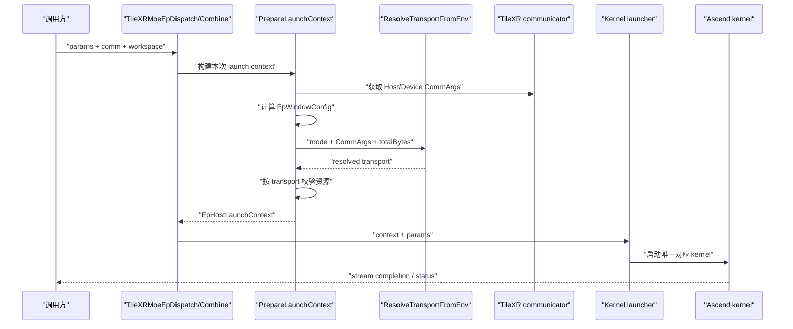

### 8.2 MEMORY 校验

Memory route：

- 要求所有 global rank 的 `peerMems[rank]` 非空；
- 不要求 `ExtraFlag::UDMA`；
- 不读取 UDMA registry；
- 不要求 `params.workspace`；
- 要求 `0 < totalBytes <= IPC_BUFF_MAX_SIZE`。

Memory dispatch launch 显式向 ordinary kernel 传 `workspace=nullptr`。即使调用方传入了 workspace，
Memory kernel 也不能因为该指针非空而误进入历史 UDMA 分支。

### 8.3 DIRECT_URMA 校验

Direct route 首先要求 UDMA capability，然后检查：

- `params.workspace != nullptr`；
- Host registry 的 `rankSize` 与 communicator 一致；
- 每个 global rank 的 region 都覆盖 `[0, requiredWorkspaceBytes)`；
- 当前 rank registry base 与 `params.workspace` 完全相等；
- 当前节点范围内的 `peerMems[]` 非空。

Direct route 只要求本节点 peer mappings：

```text
beginRank = floor(rank / localRankSize) * localRankSize
endRank   = min(beginRank + localRankSize, rankSize)
```

跨节点 peer payload 使用 UDMA，不要求远端 `peerMems[]` 映射；本节点 IPC 仍用于混合路径和 TP 辅助
交换，因此本节点 mapping 不能缺失。同机场景中本节点就是全部 rank，所以仍会检查全部 `peerMems[]`。

## 9. MEMORY 数据面

### 9.1 地址模型

Memory 数据区地址为：

```text
peerMems[peer] + IPC_DATA_OFFSET + window-relative offset
```

每个 IPC allocation 的布局是：

```text
[ 2 MiB reusable flag area ][ 100 MiB data area ]
^ peerMems[rank]            ^ peerMems[rank] + IPC_DATA_OFFSET
```

因此 EP 数据容量判断是 `totalBytes <= 100 MiB`，不能再次把 `IPC_DATA_OFFSET` 计入 100 MiB 数据区
并错误扣减容量。

### 9.2 Communicator 建立 peer window

进程模式 communicator 的主要步骤为：

1. 当前 rank 申请本地 `peerMem_[rank]`。
2. `rtIpcSetMemoryName` 导出 IPC memory name。
3. Ascend950/SuperPod 路径通过 `rtSetIpcMemorySuperPodPid(name, sdid, pid)` 授权 peer。
4. 其他 rank 使用 `rtIpcOpenMemory` 打开该 window。
5. `SyncCommArgs` 将 `peerMems[]` 上传到 device。

跨机 Memory 因此仍是设备侧 peer-memory DataCopy，不是 TCP host-staging。

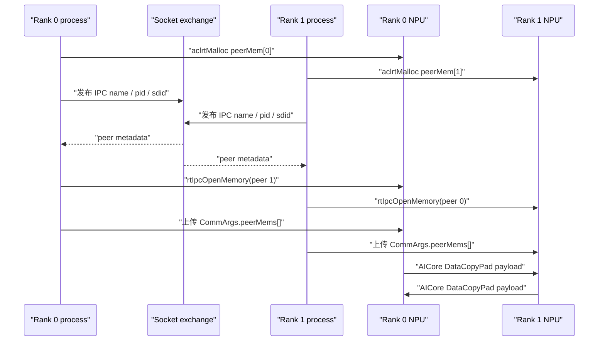

### 9.3 搬运与同步

ordinary kernel 使用 64 KiB UB，其中 4 KiB 保留给同步，剩余区域分块完成：

```text
source GM -> UB scratch -> peer GM
```

搬运使用 `DataCopyPad`，并通过 MTE event 与 `PipeBarrier` 保证块间顺序。同步 flag 使用每次调用从
`TileXRCommNextMagic` 获取的新 magic，不通过批量清零 flag 区开始新一轮。

同机和跨机 Memory 使用相同 kernel、地址模型和完成逻辑。TCP diagnostic fallback 不属于该路径。

## 10. DIRECT_URMA Workspace

### 10.1 注册模型

Direct URMA workspace 是应用拥有的一段普通 device memory：

```text
aclrtMalloc ordinary device memory
    -> TileXRUDMARegister(comm, workspace, bytes, &handle)
    -> allgather each rank {base, bytes}
    -> build one-region-per-rank TileXRUDMARegistry
    -> upload registry and update CommArgs.udmaRegistryPtr
```

当前 registry 每个 rank 只有一个连续 region，因此 dispatch、combine、relay 和 status 必须位于同一
连续注册 workspace 内。`TileXRUDMARegister` 需要 live socket exchange，不支持 `InitThread` 模式。

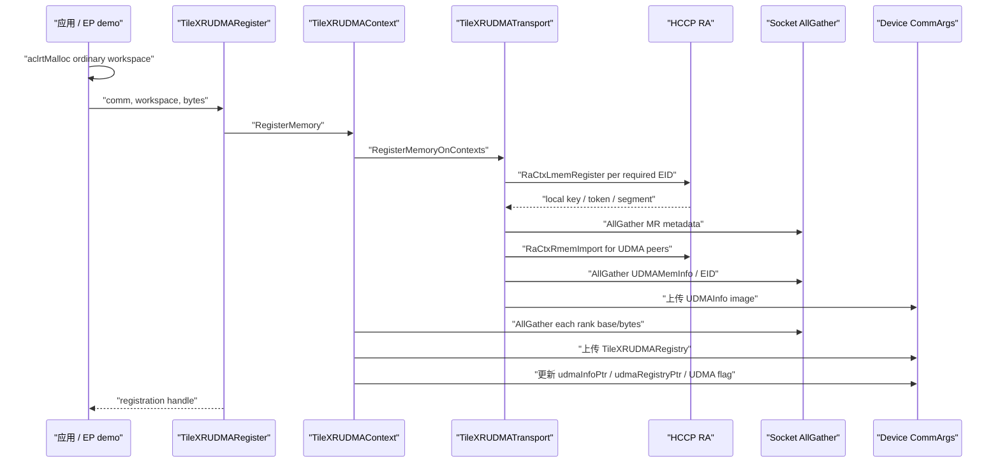

### 10.1.1 多节点 UDMA 资源范围

UDMA transport 初始化必须接收 communicator 的 `localRankSize`。在多节点 communicator 中，EP 的
Direct 数据面是 IPC/UDMA 混合模式，同节点 peer 不会执行 UDMA put，因此 Host 只为跨节点 peer
建立 UDMA route、context/QP 映射和 remote MR import：

```text
peer == self
    -> 不分配 peer UDMA 资源

localRankSize < rankSize && floor(peer / localRankSize) == floor(rank / localRankSize)
    -> 同节点 peer，使用 peerMems[]，不分配 peer UDMA 资源

其他 peer
    -> 跨节点 peer，建立 UDMA route/QP/MR
```

纯同机 communicator 的 `localRankSize == rankSize`，此时除 self 外所有 peer 仍保留 UDMA 资源，
以支持同机大报文 Direct URMA。该规则只裁剪多节点 hybrid 模式中的冗余资源，不改变同机 Direct
语义，也不改变 socket AllGather 的全局 rank 参与范围。

`localRankSize` 的 Host 传递链是：

```text
TileXRComm::GetDev
    -> TileXRComm::localRankSize_
    -> TileXRUDMAContextOptions.localRankSize
    -> TileXRUDMATransportOptions.localRankSize
    -> TileXRUDMATransport::UsesUDMAPeer
```

`UsesUDMAPeer` 的等价逻辑如下：

```cpp
if (peer is invalid or peer == rank) {
    return false;
}
if (localRankSize >= rankSize) {
    return true;  // 纯同机 Direct：所有非 self peer 使用 UDMA
}
return peer / localRankSize != rank / localRankSize;
```

该判定同时用于 `BuildRoutes` 和 remote MR import。被判定为同节点的 peer 不进入
`peerLocalEid_/peerRemoteEid_`，也不会出现在 `remoteMemHandles_` 中；`RefreshUDMAInfo` 对这些 rank
保留不被 Direct kernel 使用的占位项，从而保持 device table 仍按 global rank 索引。

2-host/16-rank 初次扩展时，每个 rank 曾为同节点 IPC peer 也创建 UDMA context 并注册 MR，导致
部分 rank 的 `RaCtxLmemRegister` 返回 `528101 (ROCE_EOPENSRC)`，随后其他 rank 的注册 AllGather
因连接断开连锁失败。传递 `localRankSize` 并只保留跨节点 UDMA peer 后，本地 MR 注册和 16-rank
dispatch/combine 均通过。

UDMA 初始化本身按以下顺序执行。`UsesUDMAPeer(peer)` 是资源规模控制点，必须在 route 解析阶段就
过滤同节点 peer，而不是创建完 QP/MR 后再在 kernel 中忽略：

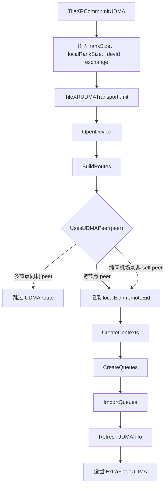

以 2-host/16-rank、每节点 8 rank 为例，rank 0 的资源关系为：

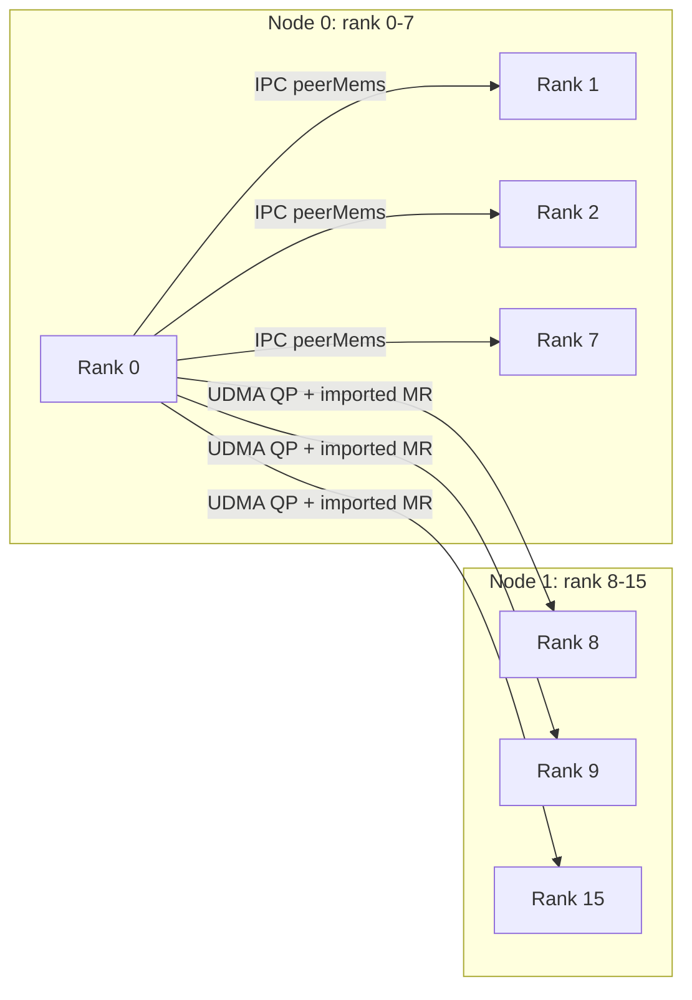

### 10.2 精确布局

定义：

```text
A = align32(totalBytes)
R = rankSize
S = slotBytes
C = 64，UDMA cache-line bytes
```

单个 operation 区布局：

```text
sendWindowOffset   = 0
recvWindowOffset   = A
readyOffset        = 2 * A
readyRankOffset(r) = readyOffset + r * C
readyBytes         = R * C
relaySlotsOffset   = align64(readyOffset + readyBytes)
relaySlotsBytes    = R * R * S
relayReadyOffset   = align64(relaySlotsOffset + relaySlotsBytes)
relayReadyRankOffset(r) = relayReadyOffset + r * C
relayReadyBytes    = R * C
operationBytes     = align64(relayReadyOffset + relayReadyBytes)
```

完整 workspace：

```text
dispatchOperationOffset = 0
combineOperationOffset  = operationBytes
statusOffset            = 2 * operationBytes
requiredWorkspaceBytes  = align64(statusOffset + 8)
```

图示：

```text
workspace
|-- dispatch operation
|   |-- send window
|   |-- recv window
|   |-- ready[R * 64B]
|   |-- relay slots[R * R]
|   `-- relay ready[R * 64B]
|-- combine operation
|   |-- send window
|   |-- recv window
|   |-- ready[R * 64B]
|   |-- relay slots[R * R]
|   `-- relay ready[R * 64B]
`-- status[1]
```

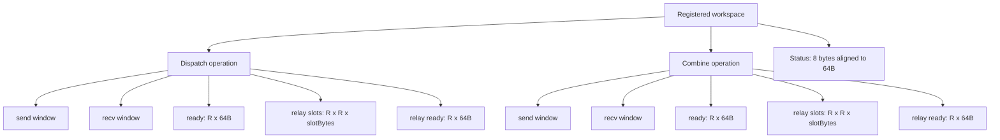

每个 ready slot 只使用首 8B 存放 `uint64_t`，其余字节为 cache-line padding。不能把 ready
压缩成连续的 `R * 8B`：当每节点存在多个 rank 时，多个远端 rank 会并发写同一条 64B cache line，
后到写入可能覆盖先到的 ready 值。实际 2-host/4-rank 验证曾表现为 rank 2 在 combine 阶段等待
rank 0 的 step 74 ready 超时；改为每 rank 独占 cache line 后，4-rank 和 8-rank Direct URMA 均通过。

`requiredWorkspaceBytes` 可能显著大于 `totalBytes`，主要原因是 `R * R * slotBytes` relay 区。
Host 和 Device 必须使用相同公式，不能用历史的 `alignedTotal * (tpWorldSize + 2)` 代替 UDMA
workspace 大小。

## 11. DIRECT_URMA 数据面

### 11.1 Kernel 选择

Host gate 为：

```text
context.transport == DIRECT_URMA
hostArgs != nullptr
rankSize > 1
slotBytes > 0
```

满足时 dispatch/combine 均启动当前名为 `*_cross_node_kernel` 的 registered-workspace kernel。
函数名保留了历史命名，但实现同时支持同机和跨机。单 rank 不属于 Direct URMA 硬件验收范围。

### 11.2 同机与跨机分类

Device kernel 计算：

```cpp
useUdmaForAllPeers = (localRankSize == rankSize);
effectiveLocalRankSize = useUdmaForAllPeers ? 1 : localRankSize;
```

语义：

- 纯同机 Direct：除 self 外的所有 EP slot peer 都视为 UDMA peer；
- 跨机 Direct：本节点 peer 继续走 IPC，跨节点 peer 走 UDMA；
- self slot 始终在本地 send/recv window 间复制，不发 UDMA；
- `effectiveLocalRankSize` 只改变 EP slot 的 transport 分类，不修改 communicator 的真实
  `localRankSize`。

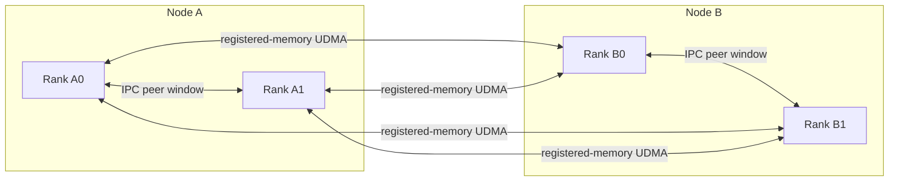

### 11.3 Dispatch

#### 同机 Direct

1. `sendWindow = workspace + dispatchOperationOffset`。
2. `recvWindow = sendWindow + align32(totalBytes)`。
3. `dispatchIpcWindow = nullptr`，强制 route payload 写入 registered `sendWindow`。
4. self slot 从 `sendWindow` 本地复制到 `recvWindow`。
5. 每个非 self peer 使用 UDMA put/signal，把本 rank 的目标 slot 写入对端 `recvWindow` 中以 src rank
   为索引的 slot。
6. 等待所有 peer ready。
7. 从本地 `recvWindow` 按 src rank drain 数据。

#### 跨机 Direct

1. 本节点非 self peer 的 route 写入当前 rank 的 IPC window。
2. 跨节点 peer 的 route 写入 registered `sendWindow`。
3. self slot本地复制到 `recvWindow`。
4. 跨节点 slot 使用 UDMA put，ready value 使用 UDMA 写入。
5. drain 时，本节点 source 从对应 `peerMems[srcRank]` 读取，跨节点 source 从 `recvWindow` 读取。

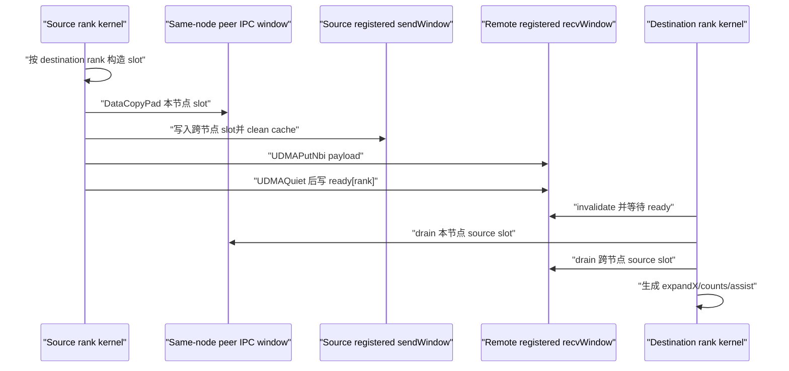

### 11.4 Combine

combine 使用第二个 operation 区：

```text
sendWindow = workspace + operationBytes
recvWindow = sendWindow + align32(totalBytes)
```

#### 同机 Direct

1. expert output 按目标 source rank scatter 到 registered `sendWindow`。
2. self slot复制到本地 `recvWindow`。
3. 非 self slot 使用 UDMA put 写入目标 rank 的 `recvWindow`。
4. ready 同步成功后，Host 读取 status。
5. Host 启动 drain kernel，从 `recvWindow` 聚合回 `yOut`。

#### 跨机 Direct

1. 本节点目标 slot 通过 `DataCopyPad` 写入目标 rank 的 IPC window。
2. 跨节点目标 slot 使用 UDMA put 写入目标 rank 的 `recvWindow`。
3. drain kernel 对本节点 expert rank 读取 IPC window，对跨节点 expert rank 读取 `recvWindow`。

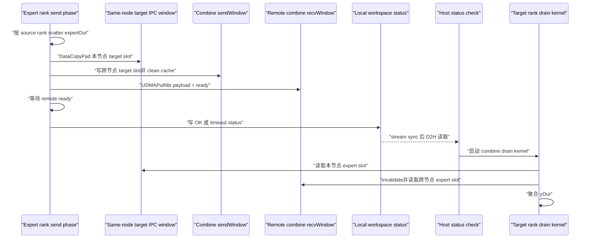

### 11.5 TP 辅助路径的边界

同机 Direct 的“所有 peer 走 UDMA”特指 EP dispatch/combine slot 数据面。TP group aggregation 当前仍
要求 TP peers 位于同一节点，并使用 `peerMems[]` 中 `TileXREpTpWindowOffset(totalBytes)` 后的 IPC
辅助窗口交换 TP rows/counts。

因此不能把当前实现描述为“同机 Direct 完全不访问 IPC”。更准确的说法是：

- 普通 EP peer slot payload 使用 UDMA；
- self slot本地复制；
- TP 辅助聚合仍可携带 rows/counts 经过 IPC；
- Direct Host 校验仍要求本节点 peer mappings。

### 11.6 Cache 与完成语义

UDMA source window 在 put 前执行 cache clean；receiver 在轮询 ready、slot header 和 status 前执行
cache invalidate。put 后调用 `UDMAQuiet`，ready value 由 magic 和 step 组合，避免复用旧轮次状态。

Host 行为：

- Direct dispatch kernel 启动后，`TileXREpCheckUdmaStatus` 会同步 stream 并读取 status，因此 Direct
  dispatch API 当前包含一次 Host 侧同步；
- Direct combine 的发送阶段也会同步并读取 status，成功后再异步启动 drain kernel；
- Memory 路径不读取 UDMA status，也不增加这次 Direct 专用同步；
- 调用方若需要 combine drain 完成，仍应按公开 stream 语义进行同步。

## 12. Status 与错误传播

Device status 位于 `workspace + statusOffset`：

| 值 | 常量 | 含义 | Host 返回 |
|---:|---|---|---|
| 0 | `kEpStatusOk` | 正常 | `TILEXR_SUCCESS` |
| 1 | `kEpStatusRemoteReadyTimeout` | combine remote ready 超时 | `TILEXR_ERROR_TIMEOUT` |
| 2 | `kEpStatusDispatchReadyTimeout` | dispatch ready 超时 | `TILEXR_ERROR_TIMEOUT` |
| 3 | `kEpStatusDispatchSlotTimeout` | dispatch source slot 或 TP slot 超时 | `TILEXR_ERROR_TIMEOUT` |

Direct kernel 启动后先把 status 写为 0；超时路径写非零值并停止当前阶段。Host 当前把所有非零 device
status 统一映射为 `TILEXR_ERROR_TIMEOUT`，详细阶段需结合 device 日志和 status 原值定位。

其他主要错误：

| 场景 | 行为 |
|---|---|
| mode 字符串未知 | `TILEXR_ERROR_PARA_CHECK_FAIL` |
| Memory peer mapping 缺失 | `TILEXR_ERROR_NOT_INITIALIZED` |
| Memory window 越过 100 MiB | `TILEXR_ERROR_PARA_CHECK_FAIL` |
| forced Direct capability 缺失 | `TILEXR_ERROR_NOT_INITIALIZED` |
| Direct workspace 为空 | `TILEXR_ERROR_NOT_INITIALIZED` |
| registry 无效、区域不足或 base 不匹配 | `TILEXR_ERROR_PARA_CHECK_FAIL` |
| stream sync / D2H status copy 失败 | `TILEXR_ERROR_INTERNAL` |

任何错误都不会切换到 host-staging。

## 13. 内存分配策略

### 13.1 peerMems IPC buffer

当前 `TileXRComm::InitMem` 仅在 `CHIP_310P3` 使用 `ACL_MEM_MALLOC_HUGE_FIRST_P2P`。Ascend950/950PR
继续使用：

```cpp
aclrtMalloc(..., ACL_MEM_MALLOC_HUGE_FIRST)
```

本次实现没有把 Ascend950 peer buffer 改成 P2P malloc。现有跨机 Memory 已在该策略下通过真实
DataCopy 验证，因此不为本功能引入额外 allocator 变更。

### 13.2 Direct workspace

Direct workspace 同样可以来自普通 `aclrtMalloc` device memory，随后调用 `TileXRUDMARegister`。
EP demo 为提高注册稳定性，会过量申请并把传入注册地址对齐到 2 MiB；这是 demo 的准备策略，当前
`TileXRUDMARegister` Host API 本身只显式校验非空地址和非零大小，不能把 demo 对齐写成通用 API
强制契约。

### 13.3 两类内存不能混为一谈

```text
peerMems[]
    communicator-owned IPC window
    MEMORY payload 和本节点/TP 辅助访问

registered workspace
    application-owned ordinary device memory
    TileXRUDMARegister 后供 Direct URMA offset addressing
```

Direct URMA target 必须是注册 workspace，不把 `peerMems[]` 直接当作 UDMA registry region，也不在
`InitThread` 中注册。

## 14. 性能数据依据

### 14.1 同机阈值：4 MiB

数据文件：

```text
D:\TileXR\full_memory_unidir_bd1.csv
D:\TileXR\full_direct_urma_unidir_bd1.csv
```

关键共同点位：

| bytes | Memory GB/s | Direct URMA GB/s | URMA / Memory | 结论 |
|---:|---:|---:|---:|---|
| 1 MiB | 44.198 | 38.688 | 0.875 | Memory 更快 |
| 2 MiB | 46.835 | 44.648 | 0.953 | Memory 更快 |
| 4 MiB | 48.871 | 48.909 | 1.001 | 交叉点，基本持平 |
| 8 MiB | 49.665 | 50.675 | 1.020 | Direct URMA 开始领先 |
| 64 MiB | 39.647 | 52.796 | 1.332 | Direct URMA 明显领先 |

因此同机阈值定为 `4 MiB`，边界归 Direct URMA。

### 14.2 跨机阈值：128 KiB

数据文件：

```text
tilexr_cross_unidir_direct_urma_bd1_8b_1g_20260728_110322.csv
tilexr_cross_unidir_memory_bd1_8b_64m_20260728_110835.csv
```

关键共同点位：

| bytes | Memory GB/s | Direct URMA GB/s | URMA / Memory | 结论 |
|---:|---:|---:|---:|---|
| 64 KiB | 7.294 | 7.274 | 0.997 | Memory 略快，基本持平 |
| 128 KiB | 10.720 | 13.558 | 1.265 | Direct URMA 首次明确领先 |
| 256 KiB | 13.981 | 24.581 | 1.758 | Direct URMA 领先 |
| 1 MiB | 17.358 | 58.278 | 3.357 | Direct URMA 明显领先 |
| 4 MiB | 18.682 | 87.424 | 4.680 | Direct URMA 明显领先 |
| 64 MiB | 18.478 | 104.790 | 5.671 | Direct URMA 明显领先 |

以上点位均为 `status=0, errors=0`，因此跨机阈值定为 `128 KiB`。

### 14.3 数据口径限制

两组 CSV 的 `bytes` 是 benchmark 单流 payload；当前 EP selector 的 `routeBytes` 是聚合 window
capacity。以 rank-2 demo 为例：

```text
BS=1024:  totalBytes=131264, slotBytes=65600
BS=32768: totalBytes=4194496, slotBytes=2097216
```

因此硬件用例跨过的是 `totalBytes` 阈值，而不是单个 remote slot payload 阈值。当前策略是明确、
确定且已正确执行的，但其性能映射是近似的。后续若优化路由精度，这一口径差异是首要改进点。

## 15. 测试与验收结果

### 15.1 Host 与源码测试

已覆盖：

- `auto/memory/direct_urma` 解析；
- 未知 mode 错误；
- 同机和跨机阈值前一字节、边界值；
- UDMA capability 缺失时 auto 回退；
- forced Direct 缺能力时报错；
- forced Memory 不依赖 registry；
- 同机 Direct launch context 校验 registry；
- Host launch 只使用 resolved `context.transport`；
- Memory launch 强制传空 workspace；
- 同机 Direct device source 包含 `useUdmaForAllPeers`；
- device auto put/get 空操作 wrapper 不再出现；
- Host runtime link block 不包含 CANN `devlib`。
- 多节点 hybrid UDMA 只为跨节点 peer 建立 transport 资源，同节点 peer 保持 IPC。

本地和 141.61.49.192/223 Linux EP 单测均为 `5/5 PASS`，两端完整 Host/Bisheng 构建成功。

### 15.2 Auto 硬件矩阵

| 拓扑 | 设备 | Demo BS | routeBytes | 选择 | 结果 |
|---|---|---:|---:|---|---|
| 跨机 2-host/2-rank | 192 card0 + 223 card0 | 4 | 704 B | Memory | 两 rank dispatch/combine PASS |
| 跨机 2-host/2-rank | 192 card0 + 223 card0 | 1024 | 131264 B | Direct URMA | 两 rank dispatch/combine PASS |
| 跨机 2-host/4-rank，每节点 2 rank | 两端 card0/card1 | 4 | 1344 B | Memory | 四 rank dispatch/combine PASS |
| 跨机 2-host/4-rank，每节点 2 rank | 两端 card0/card1 | 512 | 131392 B | Direct URMA | 四 rank dispatch/combine PASS |
| 跨机 2-host/8-rank，每节点 4 rank | 两端 card0/card1/card4/card5 | 4 | 2624 B | Memory | 八 rank dispatch/combine PASS |
| 跨机 2-host/8-rank，每节点 4 rank | 两端 card0/card1/card4/card5 | 256 | 131648 B | Direct URMA | 八 rank dispatch/combine PASS |
| 跨机 2-host/16-rank，每节点 8 rank | 两端 card0-card7 | 4 | 5184 B | Memory | 十六 rank dispatch/combine PASS |
| 跨机 2-host/16-rank，每节点 8 rank | 两端 card0-card7 | 128 | 132160 B | Direct URMA | 十六 rank dispatch/combine PASS |
| 同机 1-host/2-rank | 223 card0/card1 | 4 | 704 B | Memory | 两 rank dispatch/combine PASS |
| 同机 1-host/2-rank | 223 card0/card1 | 32768 | 4194496 B | Direct URMA | 两 rank dispatch/combine PASS |

其他已完成证据：

- 跨机 Memory demo 默认启动 AICore push/collect，结果 `seg0=2000 seg1=2001`；
- 统一 EP Host API 强制 Memory，dispatch/combine PASS；
- 独立 registered-memory UDMA put/signal PASS；
- 统一 EP Host API 强制 Direct URMA，dispatch/combine PASS；
- 2-host/4-rank Direct 首轮在 combine step 74 暴露 ready cache-line false sharing；修复为 64B stride 后通过；
- 2-host/8-rank 使用非连续空闲卡 `0,1,4,5`，避免占用当时由其他任务使用的 192 card2/card3；
- 2-host/16-rank 初轮在 MR 注册阶段暴露冗余同节点 UDMA resource 扩展问题；按 `localRankSize`
  裁剪为仅跨节点 peer 后，forced Direct 和 auto Direct 均为 16/16 PASS；
- 2-host/16-rank auto Memory 使用 `BS=4`、`routeBytes=5184 B`，16/16 PASS；auto Direct 使用
  `BS=128`、`routeBytes=132160 B`，16/16 PASS；
- demo 的 `libascend_hal.so` 解析到真实 driver 路径；
- 测试结束后，本轮进程和端口无残留，其他用户任务未被终止。

### 15.3 验证结论的边界

已证明：

- 两条真实数据面均可工作；
- 四个 auto 分支均按当前 `routeBytes` 契约选择正确 kernel；
- rank-2 同机与跨机、rank-4/rank-8/rank-16 跨机 dispatch/combine 数据正确；
- 每节点 2 rank、4 rank 和 8 rank 时，同机 IPC 与跨机 UDMA 混合数据面可工作；
- ready flag 使用 64B stride 后，多远端写者不会共享同一 UDMA cache line。
- 多节点 communicator 只为跨节点 peer 建立 UDMA transport 资源，可避免 16-rank 下的冗余 MR/QP
  资源增长。

尚未由本矩阵证明：

- 超过 2 台主机、每节点 rank 数不一致或全局 rank 未按节点连续排列的拓扑；
- 多轮循环、长时间 soak 和并发 communicator 的稳定性；
- 2-host/16-rank 的长时间 soak 和故障恢复行为；
- TP > 1 与同机 Direct 的完整硬件矩阵；
- 动态量化、shared expert 与阈值组合；
- 当前 `totalBytes` 指标对所有 EP shape 的性能最优性；
- 910B fallback 上的 UDMA 数据面，910B 本身不能替代 Ascend950 UDMA 验证。

## 16. Runtime 链接约束

Host library 和测试可执行文件的 RPATH/RUNPATH 禁止包含：

```text
${ASCEND_HOME_PATH}/${ARCH}-linux/devlib
```

该目录中的 `libascend_hal.so` 是开发 stub，错误进入 Host runtime search path 可能导致
`aclInit` 返回 `500000`。Host 必须解析真实 driver：

```text
${ASCEND_DRIVER_PATH}/lib64/driver/libascend_hal.so
```

Ascend C kernel 的 Bisheng 链接命令可以使用 `-L.../devlib`，但该路径不能传播到 Host target 的
RPATH/RUNPATH。构建后使用 `readelf -d` 和 `ldd` 分别检查路径声明和实际解析结果。

## 17. 运维与诊断约定

- `TILEXR_EP_DEMO_BS` 只用于 demo 调整 window 大小，不是生产路由配置。
- demo 输出 `dispatchWindowBytes` 和 selector 结果，用于确认阈值侧。
- `TILEXR_MEMORY_DEMO_HOST_STAGING=0` 和 `TILEXR_MEMORY_DEMO_HOST_COPY=0` 才是 Memory 数据面验收条件。
- host-staging 日志必须明确标记 diagnostic，不计入 Memory PASS。
- 硬件测试前后运行 `npu-smi info`；只使用空闲卡。
- 测试必须使用独立 `TILEXR_COMM_ID` 和 barrier 端口。
- 超时只清理本轮记录的 TileXR PID/端口，不按进程名批量终止其他任务。
- 本地与远端源码同步只使用 Mutagen，并在构建前 flush、构建后核对关键文件 SHA-256。

## 18. 后续演进建议

按优先级排列：

1. 统一性能数据和 selector 的大小口径，比较 `totalBytes`、`slotBytes`、最大 remote payload 三种指标。
2. 增加 route 决策可观测性，由生产 Host 直接记录 mode、topology、routeBytes、threshold、capability
   和 resolved transport，而不是只依赖 demo 推导。
3. 补做 2-host/16-rank soak，并扩展非均匀节点 rank 数矩阵。
4. 增加 TP、shared expert、动态量化与 Direct URMA 的组合测试。
5. 将环境变量 override 收敛到正式 config API，避免进程级可变状态。
6. 保持 allocator 改动与 transport 路由解耦；只有独立证据证明 Ascend950 必须使用 P2P malloc 时，
   才单独提出并验证 allocator 变更。
